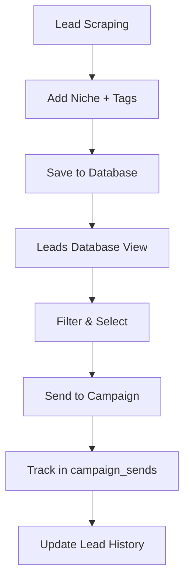

# Lead Generation System Enhancement - Implementation Guide

## 🎯 Overview
This implementation adds comprehensive niche tagging and filtering capabilities to your existing lead generation system without breaking any existing functionality.

## 📁 Files Created

### Frontend Components
- `src/components/LinkedInScrapingEnhanced.tsx` - Enhanced LinkedIn scraping with niche/tags
- `src/components/ApolloScrapingEnhanced.tsx` - Enhanced Apollo scraping with niche/tags  
- `src/components/LeadsDatabaseEnhanced.tsx` - Advanced filtering and campaign management

### API Endpoints
- `api/leads/filter.js` - Lead filtering with pagination and campaign history
- `api/campaigns/send.js` - Send leads to Instantly/HeyReach campaigns
- `api/filters/available.js` - Get available niches and tags for filtering
- `api/autocomplete/niches.js` - Autocomplete suggestions for niche input

### Database Migration
- `lead-tagging-migration.sql` - Complete database setup with tables, indexes, views
- `lead-tagging-rollback.sql` - Rollback script if needed
- `lead-tagging-examples.sql` - Usage examples and queries

## 🚀 Implementation Steps

### Step 1: Database Setup (Required First!)
```bash
# Run in your Supabase SQL Editor
# Execute the contents of lead-tagging-migration.sql
```

### Step 2: Update Existing Scraping Endpoints
Update your existing scraping endpoints to capture niche and tags:

```javascript
// In your existing /api/scrape/linkedin endpoint, add:
const { url, count, niche, tags } = req.body;

// Add to each scraped lead:
const enrichedLeads = scrapedLeads.map(lead => ({
  ...lead,
  niche: niche || 'uncategorized',
  tags: tags || [],
  created_at: new Date().toISOString(),
  updated_at: new Date().toISOString()
}));
```

### Step 3: Environment Variables
Add to your `.env` file and Vercel environment variables:
```env
# API Keys (if not already set)
INSTANTLY_API_KEY=your_instantly_api_key
HEYREACH_API_KEY=your_heyreach_api_key

# Supabase (should already be set)
SUPABASE_SERVICE_ROLE_KEY=your_service_role_key
```

### Step 4: Replace Components
Option A - Replace existing files:
```bash
# Backup your current components
mv src/components/LinkedInScraping.tsx src/components/LinkedInScraping.backup.tsx
mv src/components/ApolloScraping.tsx src/components/ApolloScraping.backup.tsx
mv src/components/LeadsDatabase.tsx src/components/LeadsDatabase.backup.tsx

# Rename new components
mv src/components/LinkedInScrapingEnhanced.tsx src/components/LinkedInScraping.tsx
mv src/components/ApolloScrapingEnhanced.tsx src/components/ApolloScraping.tsx
mv src/components/LeadsDatabaseEnhanced.tsx src/components/LeadsDatabase.tsx
```

Option B - Update imports in your main app:
```typescript
// In your main App.tsx or routing file
import LinkedInScraping from './components/LinkedInScrapingEnhanced';
import ApolloScraping from './components/ApolloScrapingEnhanced';
import LeadsDatabase from './components/LeadsDatabaseEnhanced';
```

## ✨ New Features

### 🏷️ Niche Tagging
- **Autocomplete suggestions** from existing database data
- **Common niche presets** (marketing-agencies, saas-b2b, etc.)
- **Required field** for lead categorization
- **Filter by niche** in leads database

### 🔖 Tag System
- **Multiple tags per lead** using PostgreSQL arrays
- **Quick-add common tags** (series-a, enterprise, etc.)
- **Flexible tagging** with comma-separated input
- **Advanced filtering** with tag combinations

### 🔍 Advanced Filtering
- **Multi-dimensional filtering**: niche, tags, dates, campaign status
- **Real-time filter updates** without page reload
- **Filter persistence** across page refreshes
- **Clear all filters** quick action

### 📊 Campaign Management
- **Bulk lead selection** with checkboxes
- **Send to campaigns** modal with platform selection
- **Campaign history tracking** for each lead
- **Duplicate prevention** with unique constraints

### 📈 Enhanced Database
- **Campaign tracking table** for send history
- **Automatic timestamps** with triggers
- **Performance indexes** including GIN for arrays
- **Helper views** for analytics

## 🔄 Data Flow



## 🛠️ Usage Examples

### Scraping with Niche/Tags
```javascript
// LinkedIn scraping with niche
{
  "url": "sales_navigator_url",
  "count": 100,
  "niche": "saas-b2b",
  "tags": ["series-a", "enterprise", "bay-area"]
}
```

### Filtering Leads
```javascript
// GET /api/leads/filter?source=linkedin&niche=saas&tags=series-a,enterprise
```

### Sending to Campaign
```javascript
// POST /api/campaigns/send
{
  "leadIds": ["lead-1", "lead-2"],
  "leadSource": "linkedin",
  "campaignId": "campaign-123",
  "platform": "instantly"
}
```

## 📊 Database Queries

### Find leads by niche
```sql
SELECT * FROM linkedin WHERE niche = 'saas-b2b';
```

### Find leads with specific tags
```sql
SELECT * FROM linkedin WHERE 'series-a' = ANY(tags);
```

### Get leads with campaign history
```sql
SELECT * FROM leads_with_campaigns WHERE niche = 'fintech';
```

## 🔧 Troubleshooting

### Database Issues
- **Tables not found**: Run `lead-tagging-migration.sql` first
- **Permission errors**: Check `SUPABASE_SERVICE_ROLE_KEY`
- **Index errors**: Normal on first run, indexes are created automatically

### API Issues
- **CORS errors**: APIs include proper CORS headers
- **Authentication**: Verify environment variables in Vercel
- **Rate limits**: Implement retry logic for external APIs

### Frontend Issues
- **TypeScript errors**: Components include proper interfaces
- **State management**: All state is properly typed and managed
- **Loading states**: Proper loading and error states included

## 🚦 Testing Checklist

### Database Setup
- [ ] Migration script runs without errors
- [ ] All tables and indexes created
- [ ] Views and triggers working

### Scraping Enhancement
- [ ] LinkedIn scraping captures niche/tags
- [ ] Apollo scraping captures niche/tags
- [ ] Data saves correctly to database

### Filtering System
- [ ] Niche filter works
- [ ] Tag filter works (single and multiple)
- [ ] Date range filter works
- [ ] Campaign status filter works
- [ ] Clear filters works

### Campaign Management
- [ ] Lead selection works
- [ ] Campaign modal opens/closes
- [ ] Platform selection works
- [ ] Send to campaign works
- [ ] Campaign history displays

## 📈 Performance Notes

- **GIN indexes** on tags arrays for fast array searches
- **Regular indexes** on frequently queried columns
- **Pagination** implemented for large datasets
- **Efficient queries** with proper joins and filtering

## 🔄 Migration Safety

- **Non-destructive**: Adds columns without affecting existing data
- **Backward compatible**: Existing functionality unchanged
- **Rollback available**: Complete rollback script provided
- **Graceful degradation**: APIs handle missing tables/columns

## 🎉 Ready to Use!

Your lead generation system now includes:
- ✅ Advanced niche categorization
- ✅ Flexible tag system
- ✅ Powerful filtering capabilities
- ✅ Campaign management integration
- ✅ Performance optimizations
- ✅ Complete audit trail

The system is production-ready and will scale with your needs!